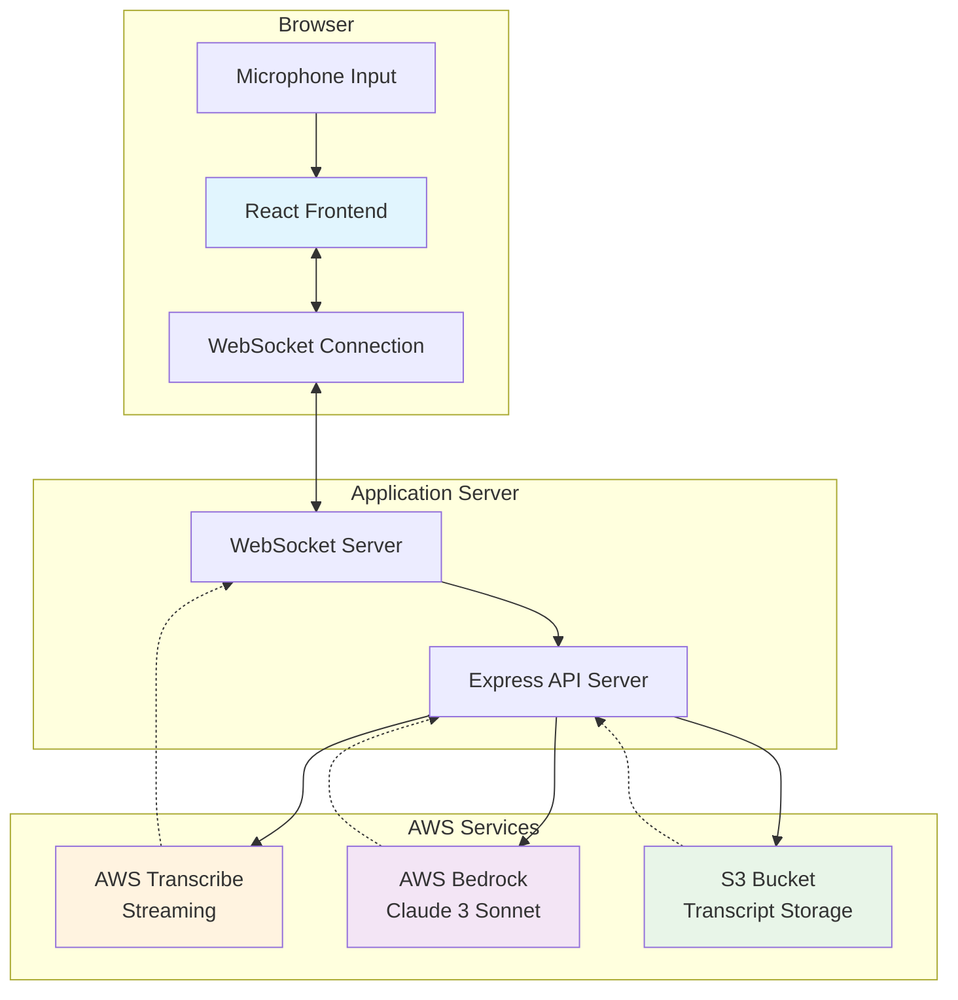
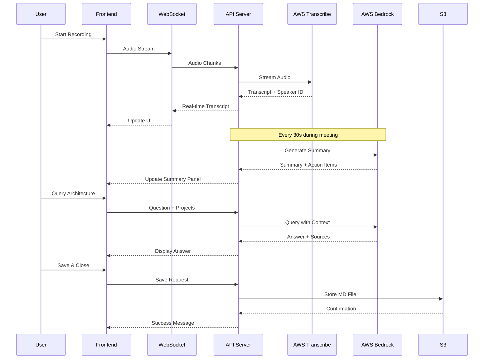
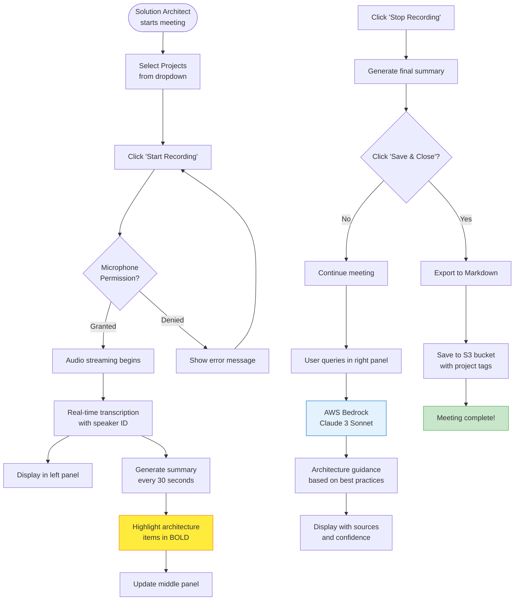
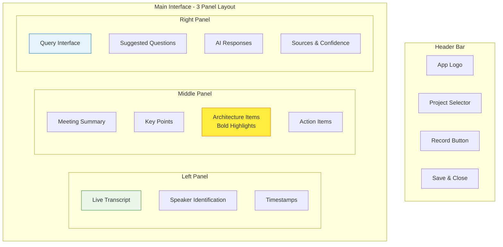
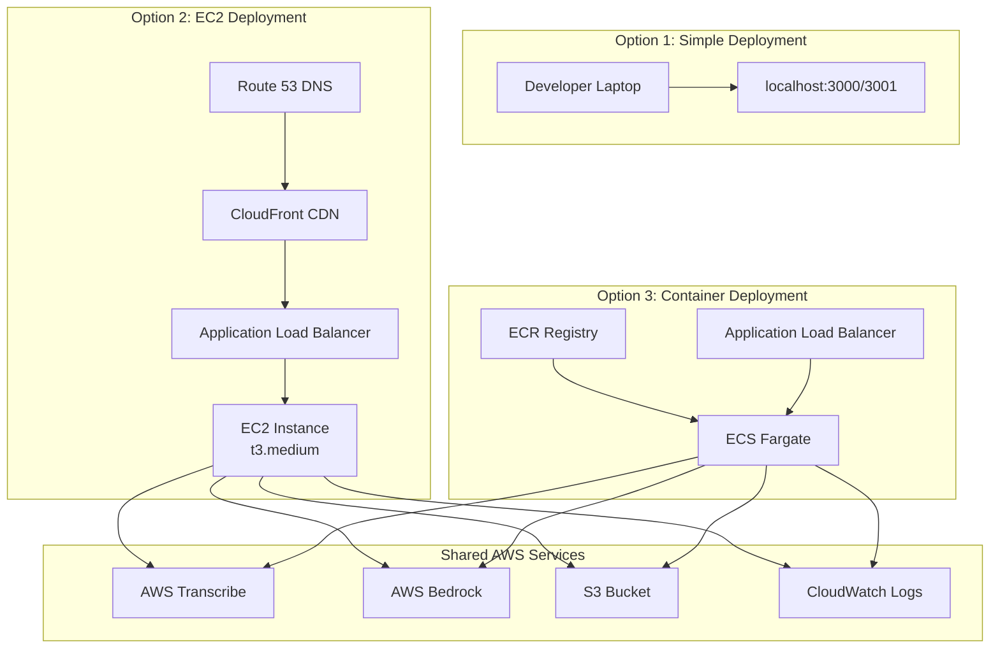
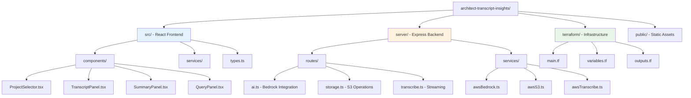
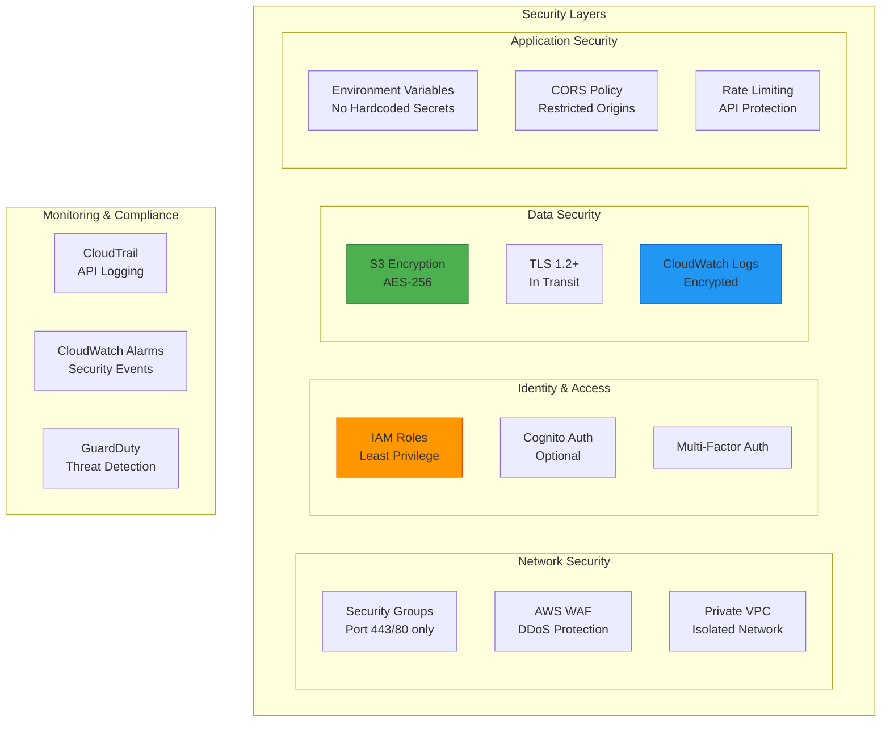
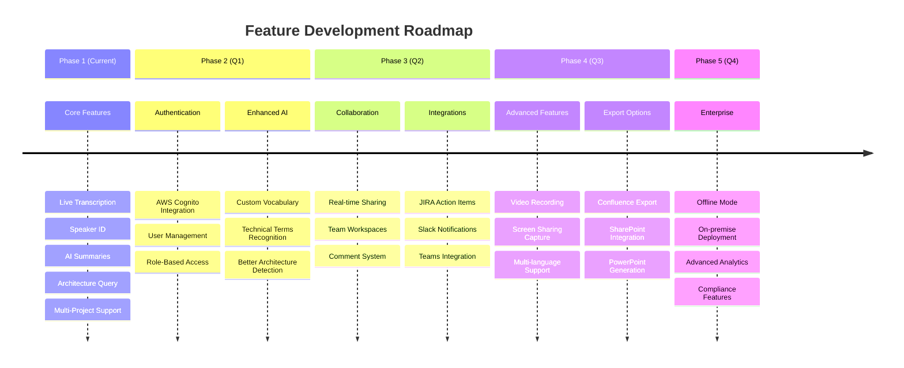

# Architect Transcript Insights Tool

A powerful real-time meeting transcription and insights tool designed for AWS Solutions Architects. This tool uses AWS Transcribe for live transcription with speaker identification, AWS Bedrock for AI-powered summaries and architecture insights, and provides an intuitive interface for querying project knowledge.

## 🏗️ System Architecture



## 🔄 Data Flow



## ✨ Features Overview

```mermaid
mindmap
  root((Architect<br/>Transcript<br/>Insights))
    Real-time Processing
      Live Transcription
      Speaker Identification
      Audio Streaming
      WebSocket Updates
    AI Intelligence
      Meeting Summaries
      Key Point Extraction
      Architecture Detection
      Action Item Tracking
    Knowledge Management
      Project Selection
      Query Interface
      Best Practices
      Source Attribution
    Storage & Export
      S3 Integration
      Markdown Export
      Project Tagging
      Version Control
    Deployment
      Terraform IaC
      Multi-Environment
      Scalable Architecture
      Security Best Practices
```



## 🔄 Complete Workflow



## 🎯 Core Features

- **🎤 Live Transcription**: Real-time meeting transcription using AWS Transcribe with automatic speaker identification
- **👥 Speaker Diarization**: Automatically identifies and labels different speakers based on voice characteristics
- **📊 AI-Powered Summaries**: Generates meeting summaries with key points, architecture decisions, and action items using AWS Bedrock
- **🏗️ Architecture Focus**: Automatically highlights and categorizes architecture-related discussions
- **🔍 Knowledge Query**: Query project knowledge and get answers based on AWS Well-Architected Framework
- **💾 Multi-Project Support**: Select and save transcripts to multiple projects simultaneously
- **📁 Cloud Storage**: Automatically saves enriched transcripts to S3 with project tagging

## Prerequisites

- Node.js 18+ and npm
- AWS Account with appropriate permissions
- AWS CLI configured (optional, for deployment)
- Modern web browser with microphone access

## AWS Services Required

1. **AWS Transcribe** - For real-time speech-to-text
2. **AWS Bedrock** - For AI summaries and knowledge queries (Claude model)
3. **AWS S3** - For transcript storage
4. **AWS IAM** - For service permissions

## Quick Start

### 1. Clone the Repository

```bash
git clone https://github.com/yourusername/architect-transcript-insights.git
cd architect-transcript-insights
```

### 2. Install Dependencies

```bash
npm install
```

### 3. Configure AWS Credentials

Copy the environment template and add your AWS credentials:

```bash
cp .env.example .env
```

Edit `.env` with your AWS credentials:

```env
AWS_REGION=us-east-1
AWS_ACCESS_KEY_ID=your-access-key-id
AWS_SECRET_ACCESS_KEY=your-secret-access-key
S3_BUCKET_NAME=architect-transcripts
```

### 4. Set Up AWS Resources

#### Create S3 Bucket

```bash
aws s3 mb s3://architect-transcripts --region us-east-1
```

#### Enable AWS Transcribe Streaming

Ensure your AWS account has access to Amazon Transcribe streaming API in your chosen region.

#### Enable AWS Bedrock

1. Go to AWS Bedrock console
2. Enable access to Claude 3 Sonnet model
3. Note: Bedrock is available in limited regions

### 5. Deploy Infrastructure with Terraform

Use the included Terraform configuration to set up all AWS resources:

```bash
cd terraform
cp terraform.tfvars.example terraform.tfvars
# Edit terraform.tfvars with your configuration
terraform init
terraform plan
terraform apply
```

This will create:
- S3 bucket with encryption and versioning
- IAM roles and policies with least privilege
- Security groups and CloudWatch logging
- Optional: Cognito, EC2, and Load Balancer

### 6. Run the Application

Start both the backend server and frontend:

```bash
npm start
```

Or run them separately:

```bash
# Terminal 1 - Backend
npm run server

# Terminal 2 - Frontend
npm run dev
```

Access the application at `http://localhost:3000`

## Usage Guide

### Starting a Meeting Transcription

1. **Select Projects**: Choose one or more projects from the dropdown to associate with the transcript
2. **Start Recording**: Click the "Start Recording" button to begin transcription
3. **Grant Microphone Access**: Allow browser access to your microphone when prompted

### During the Meeting

- **Live Transcript**: View real-time transcription in the left panel
- **Speaker Identification**: Different speakers are automatically identified and color-coded
- **Meeting Summary**: The middle panel updates periodically with:
  - Key discussion points
  - Architecture decisions and considerations (highlighted)
  - Action items with assignees

### Querying Knowledge

- Use the right panel to ask architecture-related questions
- Queries are answered using AWS Well-Architected Framework principles
- Select projects to query against their specific knowledge base

### Saving Transcripts

- Click "Save & Close" to save the enriched transcript
- Transcripts are saved as Markdown files with:
  - Full transcript with timestamps
  - AI-generated summary
  - Categorized action items
  - Architecture decisions highlighted

## 🎨 User Interface Layout



## 🚀 Deployment Architecture Options



## Project Structure



## Deployment

### Deploy with Terraform (Recommended)

The easiest way to deploy is using the included Terraform configuration:

```bash
cd terraform
cp terraform.tfvars.example terraform.tfvars
# Edit terraform.tfvars with your configuration
terraform init
terraform apply
```

See [terraform/README.md](./terraform/README.md) for detailed deployment options.

### Deploy to AWS EC2 (Manual)

1. Launch an EC2 instance (t3.medium or larger)
2. Install Node.js and npm
3. Clone the repository
4. Set up environment variables
5. Install PM2 for process management:

```bash
npm install -g pm2
pm2 start npm --name "transcript-app" -- start
pm2 save
pm2 startup
```

### Deploy with Docker

```dockerfile
FROM node:18-alpine
WORKDIR /app
COPY package*.json ./
RUN npm ci --only=production
COPY . .
RUN npm run build
EXPOSE 3000 3001
CMD ["npm", "start"]
```

Build and run:

```bash
docker build -t architect-transcript .
docker run -p 3000:3000 -p 3001:3001 --env-file .env architect-transcript
```

## Advanced Configuration

### Custom Speaker Profiles

Edit `server/services/awsTranscribe.ts` to add persistent speaker profiles:

```typescript
const knownSpeakers = {
  'voice-id-1': 'John Doe',
  'voice-id-2': 'Jane Smith'
};
```

### Project Knowledge Base

Integrate with existing knowledge bases by modifying `server/services/awsBedrock.ts`:

```typescript
// Add custom knowledge sources
const projectKnowledge = await getProjectDocuments(projectIds);
```

### Custom AI Prompts

Customize summary generation in `server/services/awsBedrock.ts`:

```typescript
function createSummaryPrompt(transcript) {
  // Modify prompt for specific focus areas
}
```

## Troubleshooting

### Microphone Not Working

1. Check browser permissions for microphone access
2. Ensure HTTPS connection (required for getUserMedia API)
3. Test microphone in browser settings

### AWS Transcribe Errors

1. Verify AWS credentials are correct
2. Check region supports Transcribe streaming
3. Ensure IAM permissions include transcribe:StartStreamTranscription

### Bedrock Not Available

1. Bedrock is only available in certain regions
2. Ensure Claude model access is enabled
3. Fall back to mock responses for development

## 🔒 Security Architecture



## 🛡️ Security Best Practices

- **Never commit `.env` file** with real credentials
- Use IAM roles with minimal required permissions
- Enable S3 bucket encryption (AES-256)
- Implement authentication for production use
- Use HTTPS in production (TLS 1.2+)
- Sanitize file names before S3 upload
- Implement rate limiting on API endpoints
- Enable VPC flow logs for network monitoring
- Use AWS Secrets Manager for sensitive data
- Regular security scanning and updates

## Contributing

1. Fork the repository
2. Create a feature branch
3. Commit your changes
4. Push to the branch
5. Open a Pull Request

## License

MIT License - feel free to use this tool for your architecture meetings!

## Support

For issues, questions, or contributions, please open an issue on GitHub.

## 🗺️ Development Roadmap



## ✅ Current Implementation Status

- [x] ✅ Live transcription with AWS Transcribe
- [x] ✅ Speaker identification and diarization  
- [x] ✅ Real-time AI summaries with AWS Bedrock
- [x] ✅ Architecture-focused insights (bold highlighting)
- [x] ✅ Knowledge query interface
- [x] ✅ Multi-project selection and tagging
- [x] ✅ S3 storage with markdown export
- [x] ✅ Terraform infrastructure as code
- [x] ✅ Security best practices implementation
- [x] ✅ Comprehensive documentation

## 🚀 Upcoming Features

- [ ] 🔐 AWS Cognito authentication
- [ ] 🤝 Real-time collaboration features  
- [ ] 📤 Export to Confluence/SharePoint
- [ ] 🌍 Support multiple languages
- [ ] 📹 Video recording capability
- [ ] 📝 Custom vocabulary for technical terms
- [ ] 🎯 JIRA integration for action items
- [ ] 📱 Offline mode with sync

## Acknowledgments

Built with:
- React + TypeScript
- AWS SDK for JavaScript
- Tailwind CSS
- Express.js
- AWS Transcribe, Bedrock, and S3

---

**Made for AWS Solutions Architects, by Solutions Architects** 🏗️