# Architect Transcript Insights Tool

A powerful real-time meeting transcription and insights tool designed for AWS Solutions Architects. This tool uses AWS Transcribe for live transcription with speaker identification, **Anthropic Claude API directly** for AI-powered summaries and architecture insights, and provides an intuitive interface for querying your **Claude Projects** knowledge base. Full transcripts are automatically uploaded to your Claude Projects for comprehensive knowledge management.

## 🏗️ System Architecture


## 🔄 Data Flow


## ✨ Features Overview


## 🔄 Complete Workflow


## 🎯 Core Features

- **🎤 Live Transcription**: Real-time meeting transcription using AWS Transcribe with automatic speaker identification
- **👥 Speaker Diarization**: Automatically identifies and labels different speakers based on voice characteristics
- **🤖 Claude AI Integration**: Direct integration with Anthropic Claude 3.5 Sonnet for superior AI-powered summaries
- **📚 Claude Projects**: Query and update your Claude Projects knowledge base with full meeting transcripts
- **🏗️ Architecture Focus**: Automatically highlights and categorizes architecture-related discussions in **BOLD**
- **🔍 Knowledge Query**: Query your Claude Projects and get answers based on your accumulated project knowledge
- **💾 Dual Storage**: Full transcripts saved to both Claude Projects (for AI knowledge) and S3 (for archival)
- **📝 Complete Transcripts**: Uploads FULL transcripts (not just summaries) to Claude Projects for comprehensive knowledge

## Prerequisites

- Node.js 18+ and npm
- **Anthropic API Key** - For Claude AI integration
- AWS Account with appropriate permissions
- AWS CLI configured (optional, for deployment)
- Modern web browser with microphone access

## Services Required

### Primary AI Service
1. **Anthropic Claude API** - Direct Claude 3.5 Sonnet integration for summaries and queries
2. **Claude Projects** - Your EXISTING Claude Projects for knowledge management
   - 📖 **[See CLAUDE_SETUP.md](./CLAUDE_SETUP.md) for detailed setup instructions**

### AWS Services
1. **AWS Transcribe** - For real-time speech-to-text
2. **AWS S3** - For transcript archival storage
3. **AWS IAM** - For service permissions
4. **AWS Bedrock** (Optional) - Fallback for Claude API if needed

## Quick Start

### 1. Clone the Repository

```bash
git clone https://github.com/yourusername/architect-transcript-insights.git
cd architect-transcript-insights
```

### 2. Install Dependencies

```bash
npm install
```

### 3. Configure API Credentials

Copy the environment template and add your credentials:

```bash
cp .env.example .env
```

Edit `.env` with your API keys and YOUR ACTUAL Claude Project IDs:

```env
# Primary - Anthropic Claude
ANTHROPIC_API_KEY=your-anthropic-api-key

# YOUR ACTUAL Claude Projects (get these from claude.ai)
# Replace with your real project IDs from your Claude account
CLAUDE_PROJECT_IDS=proj_abc123,proj_def456,proj_ghi789

# AWS Services
AWS_REGION=us-east-1
AWS_ACCESS_KEY_ID=your-access-key-id
AWS_SECRET_ACCESS_KEY=your-secret-access-key
S3_BUCKET_NAME=architect-transcripts
```

**Important**: The `CLAUDE_PROJECT_IDS` must be your ACTUAL Claude Project IDs from your claude.ai account, not example names.

### 4. Set Up AWS Resources

#### Create S3 Bucket

```bash
aws s3 mb s3://architect-transcripts --region us-east-1
```

#### Enable AWS Transcribe Streaming

Ensure your AWS account has access to Amazon Transcribe streaming API in your chosen region.

#### Enable AWS Bedrock

1. Go to AWS Bedrock console
2. Enable access to Claude 3 Sonnet model
3. Note: Bedrock is available in limited regions

### 5. Deploy Infrastructure with Terraform

Use the included Terraform configuration to set up all AWS resources:

```bash
cd terraform
cp terraform.tfvars.example terraform.tfvars
# Edit terraform.tfvars with your configuration
terraform init
terraform plan
terraform apply
```

This will create:
- S3 bucket with encryption and versioning
- IAM roles and policies with least privilege
- Security groups and CloudWatch logging
- Optional: Cognito, EC2, and Load Balancer

### 6. Run the Application

Start both the backend server and frontend:

```bash
npm start
```

Or run them separately:

```bash
# Terminal 1 - Backend
npm run server

# Terminal 2 - Frontend
npm run dev
```

Access the application at `http://localhost:3000`

## Usage Guide

### Starting a Meeting Transcription

1. **Select Claude Projects**: Check the boxes for Claude Projects in the header bar to:
   - ✅ Enable queries against their knowledge base
   - ✅ Upload the full transcript to these projects
   - ✅ Build cumulative knowledge over time
   - Each checked project will receive the complete transcript
2. **Start Recording**: Click the "Start Recording" button to begin transcription
3. **Grant Microphone Access**: Allow browser access to your microphone when prompted

### During the Meeting

- **Live Transcript**: View real-time transcription in the left panel
- **Speaker Identification**: Different speakers are automatically identified and color-coded
- **Claude AI Summary**: The middle panel updates periodically with:
  - Key discussion points
  - **Architecture decisions and considerations (in BOLD)**
  - **Architecture-related action items (in BOLD)**
  - Regular action items with assignees

### Querying Your Claude Projects

- Use the right panel to ask architecture-related questions
- Queries are answered using:
  - Your Claude Projects knowledge base (previous transcripts and documentation)
  - AWS Well-Architected Framework principles
  - Claude's extensive architecture knowledge
- Select specific projects to focus the query on their knowledge

### Saving Transcripts

- Click "Save & Close" to:
  1. **Upload FULL transcript to selected Claude Projects** (for AI knowledge base)
  2. **Save to S3** (for archival and compliance)
  3. **Download locally** (as backup)
- Transcripts include:
  - Complete unedited transcript with timestamps and confidence scores
  - AI-generated executive summary
  - Categorized action items with architecture items **in bold**
  - Full metadata and speaker information

## 📚 Claude Projects Integration

This tool deeply integrates with Claude Projects to build your knowledge base:

### Visual Project Selection

```
Header Bar:
┌─────────────────────────────────────────────────────────────────────┐
│  🧠 Architect Transcript Insights         [🎤 Start] [💾 Save & Close]│
├─────────────────────────────────────────────────────────────────────┤
│ Claude Projects: ☑ AWS Architecture  ☑ Microservices  ☐ Security   │
│                  ☑ Data Platform     ☐ DevOps        ☐ Serverless  │
│                                                      [3 selected]   │
└─────────────────────────────────────────────────────────────────────┘
                            ↓
         Selected projects will receive full transcripts
                            ↓
    ┌──────────────┬──────────────┬──────────────┐
    │     AWS      │ Microservices│     Data     │
    │ Architecture │              │   Platform   │
    └──────────────┴──────────────┴──────────────┘
           ↑              ↑              ↑
    Full Transcript  Full Transcript  Full Transcript
    + Summary       + Summary       + Summary
    + Metadata      + Metadata      + Metadata
```

### What Gets Uploaded
- **Full Transcripts**: Complete, unedited meeting transcripts (not just summaries)
- **Rich Metadata**: Speaker information, timestamps, confidence scores
- **Structured Summaries**: Key points, architecture decisions, action items
- **Project Context**: Associated with specific Claude Projects for context

### How It Helps
1. **Knowledge Accumulation**: Each meeting adds to your project's knowledge base
2. **Contextual Queries**: Future queries can reference past meetings and decisions
3. **Pattern Recognition**: Claude learns your team's terminology and patterns
4. **Architecture Evolution**: Track how your architecture decisions evolve over time

### Project-Specific Benefits

| Claude Project | Use Case | Knowledge Built |
|----------------|----------|-----------------|
| AWS Architecture | Cloud design patterns | VPC configs, service selection, scaling decisions |
| Microservices | Service decomposition | API contracts, service boundaries, communication patterns |
| Security | Compliance & threats | Security controls, audit requirements, threat models |
| Data Platform | Data architecture | ETL pipelines, data models, analytics requirements |
| DevOps | CI/CD & automation | Pipeline configs, deployment strategies, monitoring |
| Serverless | Event-driven design | Lambda patterns, event flows, cost optimization |

## 🎨 User Interface Layout

```mermaid
graph TB
    subgraph "Header Bar - Two Rows"
        subgraph "Top Row"
            LOGO[App Logo & Title]
            RECORD[Record Button]
            SAVE[Save & Close]
        end
        
        subgraph "Bottom Row - Claude Projects"
            CHECK1[☑ AWS Architecture]
            CHECK2[☑ Microservices]
            CHECK3[☐ Security]
            CHECK4[☐ Data Platform]
            CHECK5[☑ DevOps]
            COUNT[3 selected]
        end
    end
    
    subgraph "Main Interface - 3 Panel Layout"
        subgraph "Left Panel"
            LT[Live Transcript]
            SPEAKERS[Speaker Identification]
            TIMESTAMP[Timestamps]
        end
        
        subgraph "Middle Panel"
            SUMMARY[Meeting Summary]
            KEY[Key Points]
            ARCH[Architecture Items<br/>Bold Highlights]
            ACTION[Action Items]
        end
        
        subgraph "Right Panel"
            QUERY[Query Interface]
            SUGGEST[Suggested Questions]
            ANSWERS[AI Responses]
            SOURCES[Sources & Confidence]
        end
    end
    
    style ARCH fill:#ffeb3b,stroke:#f57f17
    style QUERY fill:#e3f2fd,stroke:#1976d2
    style LT fill:#e8f5e8,stroke:#388e3c
```



## 🚀 Deployment Architecture Options


## Project Structure


## Deployment

### Deploy with Terraform (Recommended)

The easiest way to deploy is using the included Terraform configuration:

```bash
cd terraform
cp terraform.tfvars.example terraform.tfvars
# Edit terraform.tfvars with your configuration
terraform init
terraform apply
```

See [terraform/README.md](./terraform/README.md) for detailed deployment options.

### Deploy to AWS EC2 (Manual)

1. Launch an EC2 instance (t3.medium or larger)
2. Install Node.js and npm
3. Clone the repository
4. Set up environment variables
5. Install PM2 for process management:

```bash
npm install -g pm2
pm2 start npm --name "transcript-app" -- start
pm2 save
pm2 startup
```

### Deploy with Docker

```dockerfile
FROM node:18-alpine
WORKDIR /app
COPY package*.json ./
RUN npm ci --only=production
COPY . .
RUN npm run build
EXPOSE 3000 3001
CMD ["npm", "start"]
```

Build and run:

```bash
docker build -t architect-transcript .
docker run -p 3000:3000 -p 3001:3001 --env-file .env architect-transcript
```

## Advanced Configuration

### Custom Speaker Profiles

Edit `server/services/awsTranscribe.ts` to add persistent speaker profiles:

```typescript
const knownSpeakers = {
  'voice-id-1': 'John Doe',
  'voice-id-2': 'Jane Smith'
};
```

### Project Knowledge Base

Integrate with existing knowledge bases by modifying `server/services/awsBedrock.ts`:

```typescript
// Add custom knowledge sources
const projectKnowledge = await getProjectDocuments(projectIds);
```

### Custom AI Prompts

Customize summary generation in `server/services/awsBedrock.ts`:

```typescript
function createSummaryPrompt(transcript) {
  // Modify prompt for specific focus areas
}
```

## Troubleshooting

### Microphone Not Working

1. Check browser permissions for microphone access
2. Ensure HTTPS connection (required for getUserMedia API)
3. Test microphone in browser settings

### AWS Transcribe Errors

1. Verify AWS credentials are correct
2. Check region supports Transcribe streaming
3. Ensure IAM permissions include transcribe:StartStreamTranscription

### Bedrock Not Available

1. Bedrock is only available in certain regions
2. Ensure Claude model access is enabled
3. Fall back to mock responses for development

## 🔒 Security Architecture


## 🛡️ Security Best Practices

- **Never commit `.env` file** with real credentials
- Use IAM roles with minimal required permissions
- Enable S3 bucket encryption (AES-256)
- Implement authentication for production use
- Use HTTPS in production (TLS 1.2+)
- Sanitize file names before S3 upload
- Implement rate limiting on API endpoints
- Enable VPC flow logs for network monitoring
- Use AWS Secrets Manager for sensitive data
- Regular security scanning and updates

## Contributing

1. Fork the repository
2. Create a feature branch
3. Commit your changes
4. Push to the branch
5. Open a Pull Request

## License

MIT License - feel free to use this tool for your architecture meetings!

## Support

For issues, questions, or contributions, please open an issue on GitHub.

## 🗺️ Development Roadmap


## ✅ Current Implementation Status

- [x] ✅ Live transcription with AWS Transcribe
- [x] ✅ Speaker identification and diarization  
- [x] ✅ Real-time AI summaries with AWS Bedrock
- [x] ✅ Architecture-focused insights (bold highlighting)
- [x] ✅ Knowledge query interface
- [x] ✅ Multi-project selection and tagging
- [x] ✅ S3 storage with markdown export
- [x] ✅ Terraform infrastructure as code
- [x] ✅ Security best practices implementation
- [x] ✅ Comprehensive documentation

## 🚀 Upcoming Features

- [ ] 🔐 AWS Cognito authentication
- [ ] 🤝 Real-time collaboration features  
- [ ] 📤 Export to Confluence/SharePoint
- [ ] 🌍 Support multiple languages
- [ ] 📹 Video recording capability
- [ ] 📝 Custom vocabulary for technical terms
- [ ] 🎯 JIRA integration for action items
- [ ] 📱 Offline mode with sync

## Acknowledgments

Built with:
- React + TypeScript
- AWS SDK for JavaScript
- Tailwind CSS
- Express.js
- AWS Transcribe, Bedrock, and S3

---

**Made for AWS Solutions Architects, by Solutions Architects** 🏗️