# 🏗️ Architect Transcript Insights Tool

A powerful, secure real-time meeting transcription and insights platform designed for AWS Solutions Architects. This enterprise-grade tool leverages **Anthropic Claude API directly**, AWS services, and advanced speaker recognition to transform your meetings into actionable architectural knowledge.

**🌐 Live Production URL**: [insights.melvin-jones.com](https://insights.melvin-jones.com)

## 🎯 Key Capabilities

- **🔐 Secure Access**: Enterprise authentication with AWS Cognito and custom domain
- **🎤 Real-time Transcription**: Live meeting transcription using AWS Transcribe with advanced speaker identification
- **🧠 Direct Claude Integration**: Uses Anthropic Claude API (not just AWS Bedrock) for superior AI insights  
- **👥 Advanced Speaker Recognition**: AWS Voice ID integration with manual training and voice pattern learning
- **📚 Claude Projects Sync**: Upload complete transcripts to your ACTUAL Claude Projects for knowledge building
- **🏗️ Architecture-Focused AI**: Automatically identifies and highlights architecture decisions and best practices
- **🔍 Intelligent Query System**: Query your accumulated project knowledge with contextual AI responses
- **💾 Dual Storage**: Full transcripts saved to both Claude Projects (AI knowledge) and S3 (archival)
- **🌐 Custom Domain**: Professional deployment at `insights.melvin-jones.com` with SSL/TLS

## 🏗️ System Architecture


## 🔄 Data Flow


## ✨ Features Overview


## 🔄 Complete Workflow


## 🎯 Core Features

- **🔐 Enterprise Security**: 
  - AWS Cognito authentication with email verification
  - JWT token-based session management
  - All API endpoints protected with authentication
  - Custom domain with SSL/TLS encryption (`insights.melvin-jones.com`)
- **🎤 Live Transcription**: Real-time meeting transcription using AWS Transcribe streaming API
- **👥 Advanced Speaker Recognition**: 
  - AWS Voice ID integration for enhanced accuracy
  - Voice characteristics analysis (pitch, tone, pace, spectral features)
  - Manual speaker identification with training feedback
  - Persistent speaker profiles that learn over time
- **🤖 Direct Claude Integration**: Anthropic Claude API (not just Bedrock) for superior AI insights
- **📚 Claude Projects Sync**: Upload complete transcripts to your ACTUAL Claude Projects for knowledge building
- **🏗️ Architecture-Focused AI**: Automatically highlights architecture decisions and best practices in **BOLD**
- **🔍 Intelligent Queries**: Query your accumulated project knowledge with contextual AI responses
- **💾 Dual Storage Strategy**: Full transcripts saved to both Claude Projects (AI knowledge) and S3 (archival)
- **🎯 Manual Training**: Users can correct speaker identification to improve future accuracy

## Prerequisites

- Node.js 18+ and npm
- **Anthropic API Key** - For Claude AI integration
- **Domain Registration** - `melvin-jones.com` (already registered)
- AWS Account with appropriate permissions
- AWS CLI configured for deployment
- Modern web browser with microphone access

## Services Required

### Primary AI Service
1. **Anthropic Claude API** - Direct Claude 3.5 Sonnet integration for summaries and queries
2. **Claude Projects** - Your EXISTING Claude Projects for knowledge management
   - 📖 **[See CLAUDE_SETUP.md](./CLAUDE_SETUP.md) for detailed setup instructions**

### AWS Services
1. **AWS Cognito** - User authentication and session management
2. **Route 53** - DNS management for custom domain
3. **Certificate Manager** - SSL/TLS certificates for HTTPS
4. **Application Load Balancer** - Traffic routing and SSL termination
5. **AWS Transcribe** - For real-time speech-to-text transcription
6. **AWS Voice ID** - For advanced speaker recognition and enrollment
7. **AWS S3** - For transcript archival storage and Voice ID audio samples
8. **AWS IAM** - For service permissions and least-privilege access
9. **AWS Bedrock** (Optional) - Fallback for Claude API if needed

## Quick Start

### 1. Clone the Repository

```bash
git clone https://github.com/yourusername/architect-transcript-insights.git
cd architect-transcript-insights
```

### 2. Install Dependencies

```bash
npm install
```

### 3. Configure API Credentials

Copy the environment template and add your credentials:

```bash
cp .env.example .env
```

Edit `.env` with your API keys and YOUR ACTUAL Claude Project IDs:

```env
# Primary - Anthropic Claude
ANTHROPIC_API_KEY=your-anthropic-api-key

# YOUR ACTUAL Claude Projects (get these from claude.ai)
# Replace with your real project IDs from your Claude account
CLAUDE_PROJECT_IDS=proj_abc123,proj_def456,proj_ghi789

# AWS Services
AWS_REGION=us-east-1
AWS_ACCESS_KEY_ID=your-access-key-id
AWS_SECRET_ACCESS_KEY=your-secret-access-key
S3_BUCKET_NAME=architect-transcripts

# AWS Voice ID (Optional - for enhanced speaker recognition)
VOICE_ID_ROLE_ARN=arn:aws:iam::your-account:role/VoiceIDServiceRole
```

**Important**: The `CLAUDE_PROJECT_IDS` must be your ACTUAL Claude Project IDs from your claude.ai account, not example names.

### 4. Set Up AWS Resources

#### Create S3 Bucket

```bash
aws s3 mb s3://architect-transcripts --region us-east-1
```

#### Enable AWS Transcribe Streaming

Ensure your AWS account has access to Amazon Transcribe streaming API in your chosen region.

#### Enable AWS Bedrock (Optional)

1. Go to AWS Bedrock console
2. Enable access to Claude 3 Sonnet model
3. Note: Bedrock is available in limited regions

#### Enable AWS Voice ID (Optional)

1. Go to AWS Voice ID console in your region
2. Note: Voice ID is available in us-east-1, us-west-2, ap-southeast-2, eu-west-1
3. Create IAM role for Voice ID service access

### 5. Deploy Infrastructure with Terraform

Use the included Terraform configuration to set up all AWS resources:

```bash
cd terraform
cp terraform.tfvars.example terraform.tfvars
# Edit terraform.tfvars with your configuration
terraform init
terraform plan
terraform apply
```

This will create:
- **Custom Domain**: `insights.melvin-jones.com` with SSL certificate
- **Authentication**: AWS Cognito User Pool with secure login
- **Load Balancer**: Application Load Balancer with HTTPS redirect
- **DNS**: Route 53 records pointing to your domain
- **S3 Storage**: Encrypted bucket with versioning for transcripts
- **IAM Roles**: Least privilege access policies
- **Voice ID**: Enhanced speaker recognition domain
- **Security**: Security groups and CloudWatch logging

### 6. Run the Application

Start both the backend server and frontend:

```bash
npm start
```

Or run them separately:

```bash
# Terminal 1 - Backend
npm run server

# Terminal 2 - Frontend
npm run dev
```

**Development**: Access at `http://localhost:3000`
**Production**: Access at `https://insights.melvin-jones.com`

## Usage Guide

### Authentication & Access

1. **Sign Up/Sign In**: Visit `https://insights.melvin-jones.com`
   - New users: Create account with email and secure password
   - Email verification required for account activation
   - Existing users: Sign in with your credentials
2. **Secure Session**: Your session is protected with AWS Cognito
   - Automatic token refresh for seamless experience
   - Session timeout for enhanced security

### Starting a Meeting Transcription

1. **Select Claude Projects**: Check the boxes for Claude Projects in the header bar to:
   - ✅ Enable queries against their knowledge base
   - ✅ Upload the full transcript to these projects
   - ✅ Build cumulative knowledge over time
   - Each checked project will receive the complete transcript
2. **Start Recording**: Click the "Start Recording" button to begin transcription
3. **Grant Microphone Access**: Allow browser access to your microphone when prompted

### During the Meeting

- **Live Transcript**: View real-time transcription in the left panel with:
  - Automatic speaker identification using voice patterns
  - Visual confidence indicators for speaker recognition
  - Manual correction buttons for training the AI
- **Advanced Speaker Recognition**: 
  - New speakers are automatically detected and flagged
  - Low-confidence identifications show warning indicators
  - Users can manually correct misidentified speakers
  - System learns from corrections to improve future accuracy
- **Claude AI Summary**: The middle panel updates periodically with:
  - Key discussion points and decisions
  - **Architecture decisions and considerations (in BOLD)**
  - **Architecture-related action items (in BOLD)**
  - Regular action items with assignees
- **Speaker Management**: 
  - Click the "Speakers" button to manage speaker profiles
  - View, edit, merge, and delete speaker identities
  - Train the system with additional voice samples

### Querying Your Claude Projects

- Use the right panel to ask architecture-related questions
- Queries are answered using:
  - Your Claude Projects knowledge base (previous transcripts and documentation)
  - AWS Well-Architected Framework principles
  - Claude's extensive architecture knowledge
- Select specific projects to focus the query on their knowledge

### Saving Transcripts

- Click "Save & Close" to:
  1. **Upload FULL transcript to selected Claude Projects** (for AI knowledge base)
  2. **Save to S3** (for archival and compliance)
  3. **Download locally** (as backup)
- Transcripts include:
  - Complete unedited transcript with timestamps and confidence scores
  - Enhanced speaker identification with voice characteristics
  - AI-generated executive summary with Claude insights
  - Categorized action items with architecture items **in bold**
  - Full speaker profile metadata and voice pattern analysis

## 📚 Claude Projects Integration

This tool deeply integrates with Claude Projects to build your knowledge base:

### Visual Project Selection

```
Header Bar:
┌─────────────────────────────────────────────────────────────────────┐
│  🧠 Architect Transcript Insights         [🎤 Start] [💾 Save & Close]│
├─────────────────────────────────────────────────────────────────────┤
│ Claude Projects: ☑ AWS Architecture  ☑ Microservices  ☐ Security   │
│                  ☑ Data Platform     ☐ DevOps        ☐ Serverless  │
│                                                      [3 selected]   │
└─────────────────────────────────────────────────────────────────────┘
                            ↓
         Selected projects will receive full transcripts
                            ↓
    ┌──────────────┬──────────────┬──────────────┐
    │     AWS      │ Microservices│     Data     │
    │ Architecture │              │   Platform   │
    └──────────────┴──────────────┴──────────────┘
           ↑              ↑              ↑
    Full Transcript  Full Transcript  Full Transcript
    + Summary       + Summary       + Summary
    + Metadata      + Metadata      + Metadata
```

### What Gets Uploaded
- **Full Transcripts**: Complete, unedited meeting transcripts (not just summaries)
- **Enhanced Speaker Data**: Advanced speaker identification with voice characteristics
- **Rich Metadata**: Speaker information, timestamps, confidence scores, voice patterns
- **Structured Summaries**: Key points, architecture decisions, action items
- **Project Context**: Associated with specific Claude Projects for context
- **Training Data**: Speaker corrections and manual identifications for system learning

### How It Helps
1. **Knowledge Accumulation**: Each meeting adds to your project's knowledge base
2. **Contextual Queries**: Future queries can reference past meetings and decisions
3. **Pattern Recognition**: Claude learns your team's terminology and patterns
4. **Architecture Evolution**: Track how your architecture decisions evolve over time

### Project-Specific Benefits

| Claude Project | Use Case | Knowledge Built |
|----------------|----------|-----------------|
| AWS Architecture | Cloud design patterns | VPC configs, service selection, scaling decisions |
| Microservices | Service decomposition | API contracts, service boundaries, communication patterns |
| Security | Compliance & threats | Security controls, audit requirements, threat models |
| Data Platform | Data architecture | ETL pipelines, data models, analytics requirements |
| DevOps | CI/CD & automation | Pipeline configs, deployment strategies, monitoring |
| Serverless | Event-driven design | Lambda patterns, event flows, cost optimization |

## 🎨 User Interface Layout

```mermaid
graph TB
    subgraph "Header Bar - Two Rows"
        subgraph "Top Row"
            LOGO[App Logo & Title]
            RECORD[Record Button]
            SAVE[Save & Close]
        end
        
        subgraph "Bottom Row - Claude Projects"
            CHECK1[☑ AWS Architecture]
            CHECK2[☑ Microservices]
            CHECK3[☐ Security]
            CHECK4[☐ Data Platform]
            CHECK5[☑ DevOps]
            COUNT[3 selected]
        end
    end
    
    subgraph "Main Interface - 3 Panel Layout"
        subgraph "Left Panel"
            LT[Live Transcript]
            SPEAKERS[Advanced Speaker Recognition]
            EDIT[Manual Correction Buttons]
            TIMESTAMP[Timestamps]
        end
        
        subgraph "Middle Panel"
            SUMMARY[Meeting Summary]
            KEY[Key Points]
            ARCH[Architecture Items<br/>Bold Highlights]
            ACTION[Action Items]
        end
        
        subgraph "Right Panel"
            QUERY[Query Interface]
            SUGGEST[Suggested Questions]
            ANSWERS[AI Responses]
            SOURCES[Sources & Confidence]
        end
    end
    
    style ARCH fill:#ffeb3b,stroke:#f57f17
    style QUERY fill:#e3f2fd,stroke:#1976d2
    style LT fill:#e8f5e8,stroke:#388e3c
```



## 🚀 Deployment Architecture Options


## Project Structure


## Deployment

### Deploy with Terraform (Recommended)

The easiest way to deploy is using the included Terraform configuration:

```bash
cd terraform
cp terraform.tfvars.example terraform.tfvars
# Edit terraform.tfvars with your configuration
terraform init
terraform apply
```

See [terraform/README.md](./terraform/README.md) for detailed deployment options.

### Deploy to AWS EC2 (Manual)

1. Launch an EC2 instance (t3.medium or larger)
2. Install Node.js and npm
3. Clone the repository
4. Set up environment variables
5. Install PM2 for process management:

```bash
npm install -g pm2
pm2 start npm --name "transcript-app" -- start
pm2 save
pm2 startup
```

### Deploy with Docker

```dockerfile
FROM node:18-alpine
WORKDIR /app
COPY package*.json ./
RUN npm ci --only=production
COPY . .
RUN npm run build
EXPOSE 3000 3001
CMD ["npm", "start"]
```

Build and run:

```bash
docker build -t architect-transcript .
docker run -p 3000:3000 -p 3001:3001 --env-file .env architect-transcript
```

## Advanced Configuration

### Advanced Speaker Recognition

The system includes sophisticated speaker recognition with multiple layers:

```typescript
// Voice characteristics analysis
interface VoiceCharacteristics {
  pitch: number;
  tone: number;
  pace: number;
  accent?: string;
  spectralCentroid?: number;
  mfccFeatures?: number[];
  formantFreqs?: number[];
}

// AWS Voice ID integration
await awsSpeakerRecognition.enrollSpeaker(
  speakerName, 
  audioSamples, 
  customSpeakerId
);
```

### Claude Projects Knowledge Base

The system directly integrates with your Claude Projects for enhanced knowledge management:

```typescript
// Direct Claude API integration
await uploadTranscriptToClaudeProject(
  transcript, 
  summary, 
  selectedProjectIds, 
  filename
);

// Query Claude Projects knowledge
const response = await queryClaudeProjects(
  question, 
  projectIds, 
  context
);
```

### Custom AI Prompts

Customize summary generation in `server/services/claudeAI.ts`:

```typescript
function createArchitectureSummaryPrompt(transcript) {
  return `Analyze this architecture meeting transcript and identify:
  - **Architecture decisions (in BOLD)**
  - Technical constraints and trade-offs
  - **Action items related to architecture (in BOLD)**
  - Risk assessments and mitigation strategies`;
}
```

## Troubleshooting

### Microphone Not Working

1. Check browser permissions for microphone access
2. Ensure HTTPS connection (required for getUserMedia API)
3. Test microphone in browser settings

### AWS Transcribe Errors

1. Verify AWS credentials are correct
2. Check region supports Transcribe streaming
3. Ensure IAM permissions include transcribe:StartStreamTranscription

### Speaker Recognition Issues

1. Check AWS Voice ID is enabled in your region
2. Verify Voice ID IAM role permissions
3. For low recognition accuracy:
   - Use manual corrections to train the system
   - Ensure good audio quality (quiet environment)
   - Allow time for voice profile building

### Claude API Issues

1. Verify your Anthropic API key is correct
2. Check your Claude Projects IDs are valid (from claude.ai)
3. Ensure sufficient API quota for your usage
4. Bedrock fallback available if Claude API fails

### Voice ID Not Working

1. Ensure AWS Voice ID is available in your region
2. Check IAM permissions for Voice ID domain creation
3. Verify S3 bucket access for voice sample storage
4. System falls back to local voice analysis if Voice ID unavailable

## 🔒 Security Architecture


## 🛡️ Security Best Practices

- **Never commit `.env` file** with real credentials
- Use IAM roles with minimal required permissions
- Enable S3 bucket encryption (AES-256)
- Implement authentication for production use
- Use HTTPS in production (TLS 1.2+)
- Sanitize file names before S3 upload
- Implement rate limiting on API endpoints
- Enable VPC flow logs for network monitoring
- Use AWS Secrets Manager for sensitive data
- Regular security scanning and updates

## Contributing

1. Fork the repository
2. Create a feature branch
3. Commit your changes
4. Push to the branch
5. Open a Pull Request

## License

MIT License - feel free to use this tool for your architecture meetings!

## Support

For issues, questions, or contributions, please open an issue on GitHub.

## 🗺️ Development Roadmap


## ✅ Current Implementation Status

- [x] ✅ **Custom Domain**: `insights.melvin-jones.com` with SSL/TLS
- [x] ✅ **Secure Authentication**: AWS Cognito with login requirement
- [x] ✅ **Protected Routes**: All API endpoints require authentication
- [x] ✅ Live transcription with AWS Transcribe streaming
- [x] ✅ Advanced speaker recognition with AWS Voice ID
- [x] ✅ Voice characteristics analysis and pattern learning
- [x] ✅ Manual speaker identification with training feedback
- [x] ✅ Persistent speaker profiles that improve over time
- [x] ✅ Direct Claude API integration (not just Bedrock)
- [x] ✅ Claude Projects synchronization for knowledge building
- [x] ✅ Real-time architecture-focused AI summaries
- [x] ✅ Intelligent query system with project context
- [x] ✅ Dual storage strategy (Claude Projects + S3)
- [x] ✅ Complete speaker management UI
- [x] ✅ Terraform infrastructure as code with domain setup
- [x] ✅ Comprehensive security implementation
- [x] ✅ Full documentation and deployment guides

## 🚀 Upcoming Features

- [ ] 🤝 Real-time collaboration features  
- [ ] 👥 Team workspaces and user management
- [ ] 📤 Export to Confluence/SharePoint
- [ ] 🌍 Support multiple languages
- [ ] 📹 Video recording capability
- [ ] 📝 Custom vocabulary for technical terms
- [ ] 🎯 JIRA integration for action items
- [ ] 📱 Offline mode with sync
- [ ] 📊 Analytics dashboard and usage metrics
- [ ] 🔔 Slack/Teams notifications

## Acknowledgments

Built with:
- React + TypeScript for modern frontend
- Express.js + TypeScript for robust backend
- AWS SDK for JavaScript v3
- Anthropic Claude API for superior AI
- AWS Transcribe for real-time transcription
- AWS Voice ID for advanced speaker recognition
- Tailwind CSS for responsive design
- WebSocket for real-time communication
- S3 for secure storage

---

**Made for AWS Solutions Architects, by Solutions Architects** 🏗️